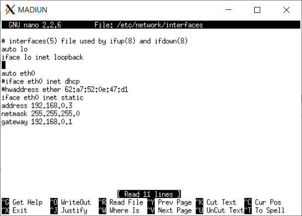

# Soal_Shift_3_A09

### Kelompok A09:
- Iman Afandy (05111740000129)
- Nodas Uziel Putra Serpara (5111840007007)

## DHCP
##  Nomor 1
<p>Yaitu untuk membuat topologi jaringan demi kelancaran TA-nya dengan kriteria sebagai berikut:</p> 
<br>

<p>  Anri sudah pernah mempelajari teknik Jaringan Komputer sehingga Anri dapat membuat topologi tersebut dengan mudah. Bu Meguri memerintahkan Anri untuk menjadikan SURABAYA sebagai router, MALANG sebagai DNS Server, TUBAN sebagai DHCP server, serta MOJOKERTO sebagai Proxy server, dan UML lainnya sebagai client. Bu Meguri berpesan pada Anri untuk menyusun topologi secara hati-hati dan memperhatikan gambar topologi yang diberikan Bu Meguri. Karena TUBAN jauh dari client, maka perlu adanya perantara agar bisa saling terhubung. </p>

#### Jawab 
<p>1. Mengedit Topologi menjadi :</p> 

```
# Switch
uml_switch -unix switch1 > /dev/null < /dev/null &
uml_switch -unix switch2 > /dev/null < /dev/null &
uml_switch -unix switch3 > /dev/null < /dev/null &

# Router
xterm -T SURABAYA -e linux ubd0=SURABAYA,jarkom umid=SURABAYA eth0=tuntap,,,10.151.72.41 eth1=daemon,,,switch1 eth2=daemon,,,switch3 eth3=daemon,,,switch2 mem=256M &

# Server
xterm -T MALANG -e linux ubd0=MALANG,jarkom umid=MALANG eth0=daemon,,,switch2 mem=160M &
xterm -T MOJOKERTO -e linux ubd0=MOJOKERTO,jarkom umid=MOJOKERTO eth0=daemon,,,switch2 mem=128M &
xterm -T TUBAN -e linux ubd0=TUBAN,jarkom umid=TUBAN eth0=daemon,,,switch2 mem=128M &

# Klien
xterm -T BANYUWANGI -e linux ubd0=BANYUWANGI,jarkom umid=BANYUWANGI eth0=daemon,,,switch3 mem=64M &
xterm -T SIDOARJO -e linux ubd0=SIDOARJO,jarkom umid=SIDOARJO eth0=daemon,,,switch1 mem=64M &
xterm -T GRESIK -e linux ubd0=GRESIK,jarkom umid=GRESIK eth0=daemon,,,switch1 mem=64M &
xterm -T MADIUN -e linux ubd0=MADIUN,jarkom umid=MADIUN eth0=daemon,,,switch3 mem=64M &
```
<p>2. Menghapus # pada IP Forward di sysctl.conf (SURABAYA)</p> 

```
nano /etc/sysctl.conf (surabaya)
uncomment net.ipv4.ip_forward=1
sysctl -p
```
<br>

<p>3. Membuat Interface </p> 
<br>

<br>

<br>

<br>

<br>

<br>

<br>

<br>

<p>4. Melakukan Iptable di Surabaya </p> 

```
iptables -t nat -A POSTROUTING -o eth0 -j MASQUERADE -s 192.168.0.0/16
```
<p>5. Instal dhcp server di TUBAN </p> 

```
apt-get install isc-dhcp-server
```
<p>6. Tambah "eth0" pada INTERFACES di isc-dhcp-server</p> 

```
nano /etc/default/isc-dhcp-server
```
<br>


##  Nomor 2

```
SURABAYA ditunjuk sebagai perantara (DHCP Relay) antara DHCP Server dan client.
Kriteria lain yang diminta Bu Meguri pada topologi jaringan tersebut adalah: Seluruh client TIDAK DIPERBOLEHKAN menggunakan konfigurasi IP Statis.
```
#### Jawab 
<p>1. Install dhcp relay di SURABAYA</p> 

```
apt-get install isc-dhcp-relay
```
<p>2. Masukan Ip Tuban dan juga interface yang akan digunakan untuk menerima request yaitu eth1,eth2,eth3</p>
<br>

<br>

<p>3. Cek settingannya apakah sudah benar</p>

```
nano /etc/default/isc-dhcp-relay
```
<br>

<p>4. Tambahkan subnet NID_DMZ seperti berikut agar dhcp relay bisa berjalan</p>

```
subnet 10.151.73.80 netmask 255.255.255.248 {
    option routers 10.151.73.81;
}
```
<br>

<p>5. Ubah semua client yang awalnya static menjadi menggunakan dhcp</p>
<br>

<br>

<br>

<br>


## Nomor 3 - 6

```
(3) Client pada subnet 1 mendapatkan range IP dari 192.168.0.10 sampai 192.168.0.100 dan 192.168.0.110 sampai 192.168.0.200.
(4) Client pada subnet 3 mendapatkan range IP dari 192.168.1.50 sampai 192.168.1.70.
(5) Client mendapatkan DNS Malang dan DNS 202.46.129.2 dari DHCP
(6) Client di subnet 1 mendapatkan peminjaman alamat IP selama 5 menit, sedangkan (6) client pada subnet 3 mendapatkan peminjaman IP selama 10 menit.
```
#### Jawab 
<br>

<p>Hasil Testing</p>
<br>

<br>

<br>

<br>


## Nomor 7

(7) Buat user autentikasi dengan format user : userta_yyy dan pass: inipassw0rdta_yyy

## Jawab 
<br> 
Install squid3 dan apache utils di mojokerto 

```
apt-get install squid3
apt-get install apache2-utils
```
buat file user 
```
htpasswd -c /etc/squid/passwd userta_a09
```
masukan password inipassw0rdta_a09
dan buat file backup 

```
mv /etc/squid/squid.conf /etc/squid/squid.conf.bak
```
edit etc/squid3/squid.conf 
<br>


<br>
Hasil : 
<br>


## Nomor 8-9
(8) Batasi penggunaan internet hanya pada Selasa-Rabu pukul 13.00-18.00 saat pengerjaan TA 
(9) Batasi penggunaan internet hanya pada Selasa-Kamis pukul 21.00 - 09.00 keesokan harinya (sampai
Jumat jam 09.00) untuk bimbingan TA 

## Jawab 
edit file /etc/squid3/squid.conf 

<br>


## Nomor 10 
(10) Setiap mengakses google.com, maka akan di redirect menuju monta.if.its.ac.id

## Jawab 


